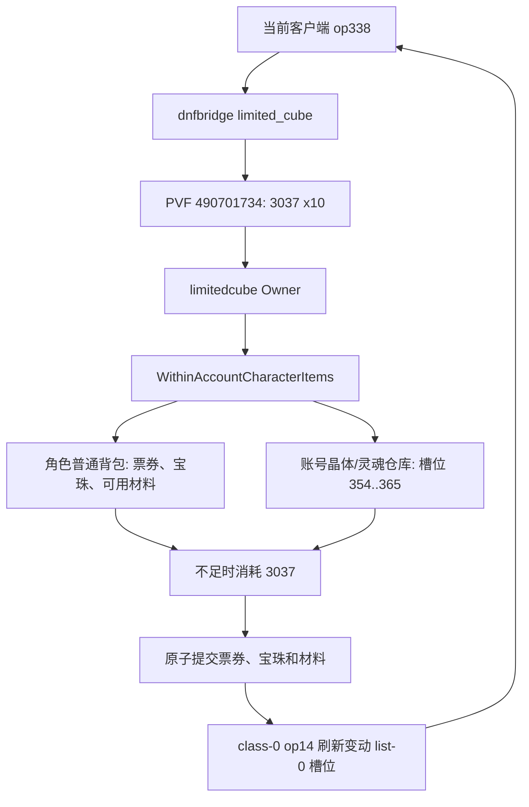

# 宠物附魔宝珠变换票券协议与材料归属报告

> 日期：2026-08-05  
> 范围：本地 DNF90 单账号实例、当前 `Script.pvf`、服务端 `op338` 实现  
> 结论：已修复并部署

## 范围

本次只验证宠物附魔宝珠变换票券 `490701734` 的城镇使用路径，以及材料 `3037`（无色小晶块）的角色背包和账号晶体/灵魂仓库归属。未修改 PVF、客户端文件或数据库中的道具数量。

## 证据

### E-001

- title: 账号晶体仓库持有变换所需无色小晶块
- observed_at: 2026-08-05
- source_type: database
- source_ref: 本地 `dnf_account_inventory_items` 的账号 `dnf:1`、槽位 `0:358`
- content_hash: n/a
- repro_command: |
    通过本地运行时数据库只读查询账号库存，筛选 item_id=3037。
- raw_excerpt: |
    account_id=dnf:1, entry_key=0:358, item_id=3037, item_count=9989948
- linked_workitem: n/a
- supersedes: none

### E-002

- title: 真实 PVF 定义票券、宝珠池与无色材料要求
- observed_at: 2026-08-05
- source_type: command
- source_ref: `go-server/internal/services/dnfbridge/limited_cube_test.go`
- content_hash: `EC7050524DDD2CB5126F4BC9ABAF438B602360CCCDBC15D1BE6AB291A2DC204A`
- repro_command: |
    cd go-server
    $env:DNFBRIDGE_REAL_PVF_SMOKE='D:\DNF\runtime\data\dnf\Script.pvf'
    go test -buildvcs=false -count=1 ./internal/services/dnfbridge -run 'TestRealPVFPetBeadChange(TicketsResolveExactPVFPool|TicketConsumesCrystalWarehouseMaterial)$'
- raw_excerpt: |
    票券 490701734 的 B condition 为 3037 x10；目标 490007240 在 91 个宝珠候选中。
- linked_workitem: n/a
- supersedes: none

### E-003

- title: 修复后的服务端通过完整验证并处于 READY
- observed_at: 2026-08-05
- source_type: command
- source_ref: `deploy/windows/control.bat status`
- content_hash: `B91A8A93412A5B1F466BBDC6273E8EE53AE7FC94B699377D33AB1D3005B3EB75`
- repro_command: |
    cd go-server
    ..\deploy\windows\control.bat status
- raw_excerpt: |
    DNF90Server READY，MySQL READY，120 个监听端口接受连接。
- linked_workitem: n/a
- supersedes: none

## 发现

### F-001

- title: 变换票券材料检查错误地排除了账号晶体/灵魂仓库
- severity: n/a_re
- category: design
- status: validated
- evidence_ids: [E-001, E-002]
- confidence: high
- location: `go-server/internal/modules/dnf/limitedcube/owner.go`
- impact: 角色背包没有无色、但可见晶体/灵魂仓库有充足无色时，`op338` 被拒绝并被客户端显示为不准确的状态错误。
- repro_steps:
  1. 将票券和目标宝珠放在角色普通背包。
  2. 仅在账号共享槽位 `354..365` 放入 `3037`。
  3. 在城镇使用票券。
- remediation: 通过 `WithinAccountCharacterItems` 原子读取和保存角色背包及账号共享库存；普通背包优先消耗，再消耗共享仓库；对两类变动发送同一已验证的 list-0 `op14` 刷新。

## 调用与数据路径

### P-001

- title: 宠物附魔宝珠变换调用路径
- path_type: callflow
- start: 客户端在城镇对票券发起 `op338`
- goal: 用 PVF 权威的随机结果替换宝珠并扣除 `3037 x10`
- steps:
  1. action: 解析票券、目标宝珠及 PVF 条件；evidence: E-002; finding: F-001
  2. action: 在原子事务中先扫描普通背包，再扫描账号共享晶体/灵魂槽位；evidence: E-001; finding: F-001
  3. action: 提交后用 class-0 `op14` 回写变动槽位；evidence: E-003; finding: F-001
- residual_risks: 票券和目标宝珠仍必须位于角色普通背包；锁定的材料栈会被拒绝，符合既有锁定规则。

## 验证与部署

执行了 DNF 模块全量测试、完整 `dnfbridge` 测试、控制器测试、`go vet`、真实 PVF 回归和 BAT 离线预检。构建后的 `runtime/bin/DNF90Server.exe` SHA256 为 `B91A8A93412A5B1F466BBDC6273E8EE53AE7FC94B699377D33AB1D3005B3EB75`；通过 `control.bat` 重启后服务 READY。

## 时间线

1. 通过账号库存确认无色位于共享槽位 `0:358`，而非角色普通背包。
2. 将材料归属纳入 `op338` 的原子账号/角色物品事务，并补充共享槽位刷新。
3. 使用真实 PVF 回归、构建、BAT 预检和重启状态验证修复。
